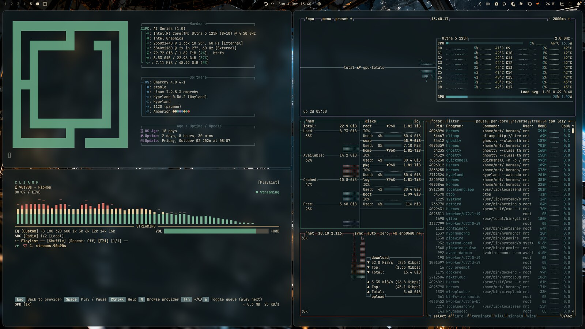

# Amberion

A dark Omarchy theme: deep teal background, **amber accent**, warm cream text. Five 4K wallpapers (3840×2160) share a teal and amber base, each with its own color highlight.



## Installation

In the Omarchy menu choose `Install > Style > Theme` and enter this repo URL, or run:

```bash
omarchy theme install https://github.com/mrt187/omarchy-amberion-theme
```

## Wallpapers

| File | Scene | Accent |
|---|---|---|
| `00-station.jpg` | Astronaut in an abandoned space station | Cyan |
| `01-desert.jpg` | Desert dunes under two suns | Pink |
| `02-city.jpg` | Neon city in the rain | Red |
| `03-ice.jpg` | Ice planet with aurora | Green |
| `04-helmet.jpg` | Astronaut helmet close-up | Violet |

## Colors

| Name | Value |
|---|---|
| accent | `#c3915d` |
| selection | `#1f3436` |
| selection foreground | `#e8d9bd` |
| muted | `#5d7578` |
| background | `#101a1d` |
| dark background | `#0c1416` |
| darker background | `#080f11` |
| lighter background | `#1b2c2f` |
| foreground | `#e2d3b5` |
| dark foreground | `#b3a78f` |
| light foreground | `#eadfc7` |
| bright foreground | `#f3ead6` |
| red | `#c0584a` |
| yellow | `#d6b878` |
| orange | `#d38a52` |
| green | `#5f9a7c` |
| cyan | `#4f9a98` |
| blue | `#4a7ea0` |
| magenta | `#9a7aa8` |
| brown | `#98673c` |
| bright red | `#de6f62` |
| bright yellow | `#ecd0a0` |
| bright green | `#7fb898` |
| bright cyan | `#72b8b4` |
| bright blue | `#5b96ba` |
| bright magenta | `#b898c4` |

## License and AI disclosure

The wallpapers are **AI-generated** (OpenAI image generation) and upscaled to 4K with Real-ESRGAN. Theme and wallpapers are released under [CC BY 4.0](https://creativecommons.org/licenses/by/4.0/), see `LICENSE.md`.
